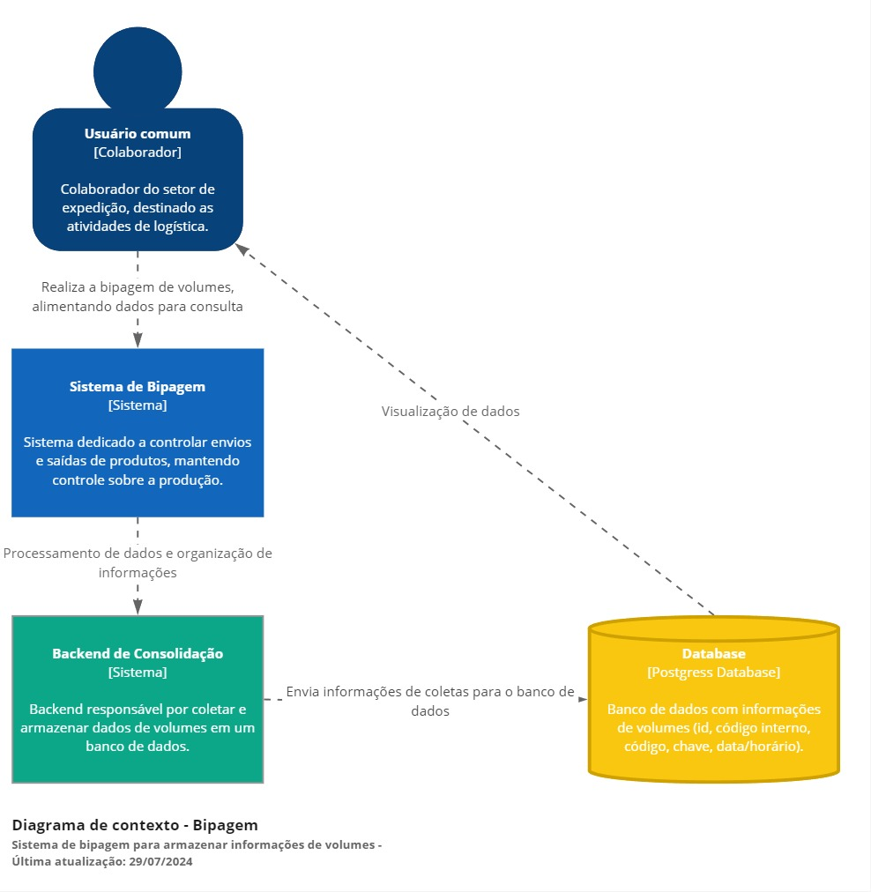
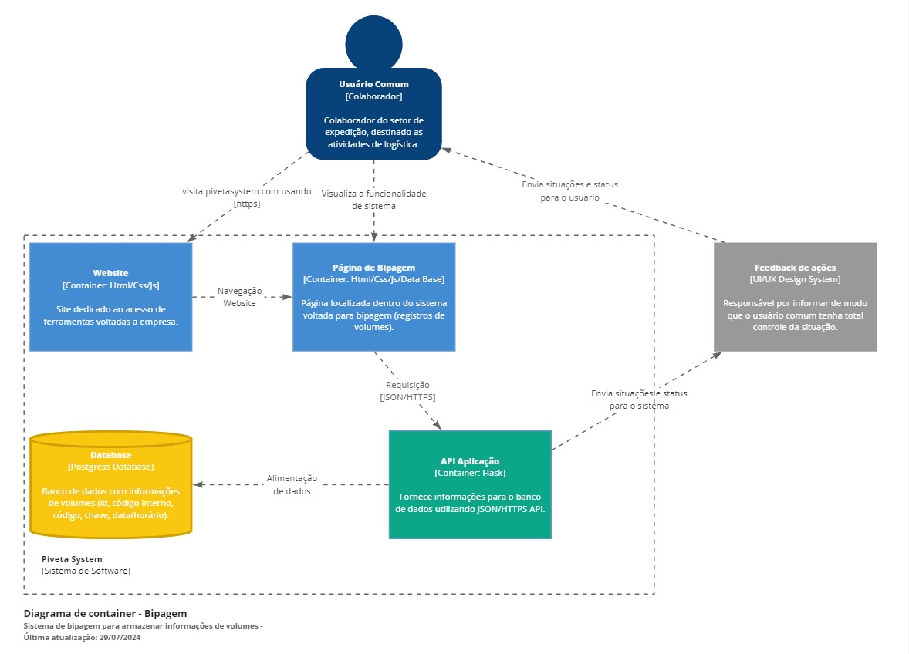

### Piveta System - Chat-BOT 🤖
  
---
  
Um chat-bot é um programa de computador projetado para simular conversas humanas através de mensagens de texto ou voz. Ele utiliza inteligência artificial para entender e responder a perguntas, realizar tarefas automatizadas e oferecer suporte em tempo real. Chat-bots são amplamente utilizados em atendimento ao cliente, marketing e outras áreas, proporcionando interações rápidas e eficientes com usuários.
  
### Pré-requisitos
  
---
  
Antes de iniciar, certifique-se de que você tem os seguintes itens:
  
- Acesso a um terminal de comando.
- Permissões adequadas para criar diretórios e arquivos no sistema.
  
### Arquitetura do Projeto
  
---

Para facilitar a compreensão, utilizei a abordagem de arquitetura C4 para ilustrar de maneira clara e organizada o funcionamento do processo de bipagem, destacando as diferentes camadas e seus componentes essenciais.

##### Contexto de Bipagem

A primeira etapa do desenho é mostrar as interações de forma macro, focando nas comunicações e dependências entre sistemas e usuários no processo de bipagem. Esse diagrama deve ser compreendido por todos os envolvidos no projeto, tanto técnicos quanto de negócios, que interagem direta ou indiretamente com o sistema.



##### Container de Bipagem

O segundo nível detalha o sistema, descrevendo seus containers e como eles se comunicam. Foca na arquitetura e tecnologias usadas, mostrando como o sistema é construído de forma macro. Um container pode ser uma aplicação web, um banco de dados, ou um sistema de arquivos. Este diagrama é direcionado à equipe técnica, como desenvolvedores e profissionais de suporte.



##### Componentes de Bipagem

No terceiro nível, detalhamos as partes que compõem os containers, incluindo interações, responsabilidades e tecnologias de forma mais minuciosa. Um sistema pode ter vários diagramas de componente, focando na equipe técnica de desenvolvimento.


  
### Estrutura do Projeto
  
---
  
##### Diretórios e Arquivos
  
  
```RP/
├── app/
│   ├── static/
│   |    ├── css/
│   |    │   └── bipagem.css
│   |    └── js/
│   |        └── bipagem.js
│   ├── templates/
│   │    └── bipagem.html
│   ├── utils/
│   │    ├── bipagem.py
│   │    └── conexao.py
│   ├── __init__.py
│   ├── .flaskenv
│   └── routes.py
├── venv/
└── requirements.txt
```	
  
### Backend (Flask)
  
---
  
##### Instalação de Dependências
  
Instale as dependências do projeto com o seguinte comando: ```pip install -r requirements.txt```
  
##### Configuração do Banco de Dados
  
A conexão ao banco de dados PostgreSQL é feita na função ``connect_db()``:
  
``` ruby
import psycopg2
  
def connect_db():
    return psycopg2.connect(
        dbname="yourdbname",
        user="yourdbuser",
        password="yourdbpassword",
        host="yourdbhost",
        port="yourdbport"
    )
```
  
##### Rotas
Definimos uma rota /add_produtos para inserir produtos no banco de dados:
  
``` Ruby
from flask import Flask, request, jsonify
from datetime import datetime
  
app = Flask(__name__)
  
@app.route('/add_produtos', methods=['POST'])
def add_produtos():
    data = request.get_json()
    produtos = data['produtos']
  
    conn = connect_db()
    cursor = conn.cursor()
  
    inserted_ids = []
    for produto in produtos:
        codigo_interno = produto['codigo_interno']
        codigo = produto['codigo']
        chave = produto['chave']
        data_hora = datetime.now()
        cursor.execute(
            "INSERT INTO produtos (codigo_interno, codigo, chave, data_hora) VALUES (%s, %s, %s, %s) RETURNING id",
            (codigo_interno, codigo, chave, data_hora)
        )
        inserted_id = cursor.fetchone()[0]
        inserted_ids.append(inserted_id)
  
    conn.commit()
    cursor.close()
    conn.close()
  
    if inserted_ids:
        return jsonify({"message": "Produtos adicionados com sucesso!", "inserted_ids": inserted_ids}), 201
    else:
        return jsonify({"message": "Falha ao adicionar produtos."}), 500
  
if __name__ == '__main__':
    app.run(debug=True)
```
  
### Frontend
  
---
  
##### HTML
O HTML contém a informações cruciais frizando a importância da usabilidade do rastreio:
  
Ex:
  
``` Ruby
<div id="popup-finalizar-container" class="popup-finalizar-container" style="display:none;">
                    <div class="popup-finalizar">
                        <h2>Confirmação<span class="close-button-confirm">&times;</span></h2>
                        <div class="aviso-cuidado">
                            <i class="fa fa-exclamation-triangle" aria-hidden="true"></i>
                            <p>Com a operação finalizada não poderá ser feito mais alterações.</p>
                        </div>
                        <p class="confirm-message">Uma vez finalizado, a operação será <b>salva e todos os registros
                                serão carregados</b> e não poderá ser alterado.
                            <br><br>Deseja finalizar esta operação?
                        </p>
                        <div class="button-container-confirm">
                            <button class="button-cancel">Cancelar</button>
                            <button class="button-confirm" id="save-table-data">Finalizar</button>
                        </div>
                    </div>
                </div>
```
##### CSS
  
O CSS estiliza os componentes da página:
  
1. Atributo ``style`` para Ocultar o Popup:
  
O atributo ``style`` é aplicado ao elemento ``div`` do popup para torná-lo inicialmente oculto. Utilize a propriedade ``display`` com o valor ``none``.
  
Ex: ``<div id="meuPopup" style="display: none;">...</div>``
  
2. ``Keyframe`` para animação:
  
As ``keyframes`` são a base para criar animações CSS fluidas e complexas. Elas definem os pontos-chave da animação, especificando como os elementos da página devem se transformar ao longo do tempo.
  
Ex: 
``` Ruby
@keyframes dots {
    0%,
    20% {
        content: "";
    }
    40% {
        content: ".";
    }
    60% {
        content: "..";
    }
    80%,
    100% {
        content: "...";
    }
}
```
  
3. ``Media Queries`` para redimensionar:
  
As ``Media Queries`` permitem adaptar o layout e o estilo de uma página com base em diferentes características do dispositivo do usuário, como tamanho da tela, orientação, resolução e tipo de dispositivo (desktop, tablet, mobile).
  
Ex:
  
``` Ruby
@media only screen and (max-width: 1150px) {
    .popup-finalizar {
        width: 60% !important;
    }
}
```
##### Javascript
  
O JavaScript dá vida aos popups ocultos controlando sua visibilidade e interação com o usuário, funcionalidades de data hora, e até mesmo um contador de volumes.
  
1. Mostrar o Popup:
  
Utilize a propriedade ``display`` do elemento ``div`` e defina seu valor como ``block`` para tornar o popup visível. Isso pode ser feito em resposta a eventos específicos, como cliques em botões ou ações do usuário.
  
Ex:
  
``` Ruby
const meuPopup = document.getElementById('meuPopup');
const botaoAbrir = document.querySelector('.botao-abrir');
  
botaoAbrir.addEventListener('click', () => {
  meuPopup.style.display = 'block';
});
```
  
2. Ocultar o Popup:
  
Para fechar o popup, defina a propriedade ``display`` do elemento ``div`` como ``none`` novamente. Isso pode ser feito através de botões de fechamento, clique fora do popup ou outras ações desejadas.
  
Ex:
  
``` Ruby
const meuPopup = document.getElementById('meuPopup');
const botaoFechar = document.querySelector('.botao-fechar');
  
botaoFechar.addEventListener('click', () => {
  meuPopup.style.display = 'none';
});
```
  
3. Função de data/hora:
  
As funções de data e hora permite que manipule e processe informações de datas e horários de forma eficiente. Elas oferecem diversas funcionalidades para lidar com diferentes aspectos do tempo, como por exemplo a obtenção da data atual.
  
``` Ruby
function dataTable() {
    const now = new Date();
    let day = now.getDate().toString().padStart(2, '0');
    let month = (now.getMonth() + 1).toString().padStart(2, '0');
    let year = now.getFullYear();
    let hours = now.getHours().toString().padStart(2, '0');
    let minutes = now.getMinutes().toString().padStart(2, '0');
    let seconds = now.getSeconds().toString().padStart(2, '0');
  
    return `${day}/${month}/${year} - ${hours}:${minutes}:${seconds}`;
}
dataTable();
```
  
4. Função de Contador:
  
A função contador é uma ferramenta para gerenciar contagens repetitivas de forma eficiente e precisa. Utilizamos para iterar  lista de dados e acompanhar a quantidade de registros do algoritmo.
  
``` Ruby
function getNextProductNumber() {
    let newNumber = lastProductNumber;
    lastProductNumber += 4;
    return newNumber.toString().padStart(4, '0');
}
```
  
### Conclusão
  
---
  
Este sistema permite a inserção, edição e exclusão de produtos, armazenando todas as operações em um banco de dados PostgreSQL. O frontend responsivo garante uma boa experiência do usuário em diferentes dispositivos.