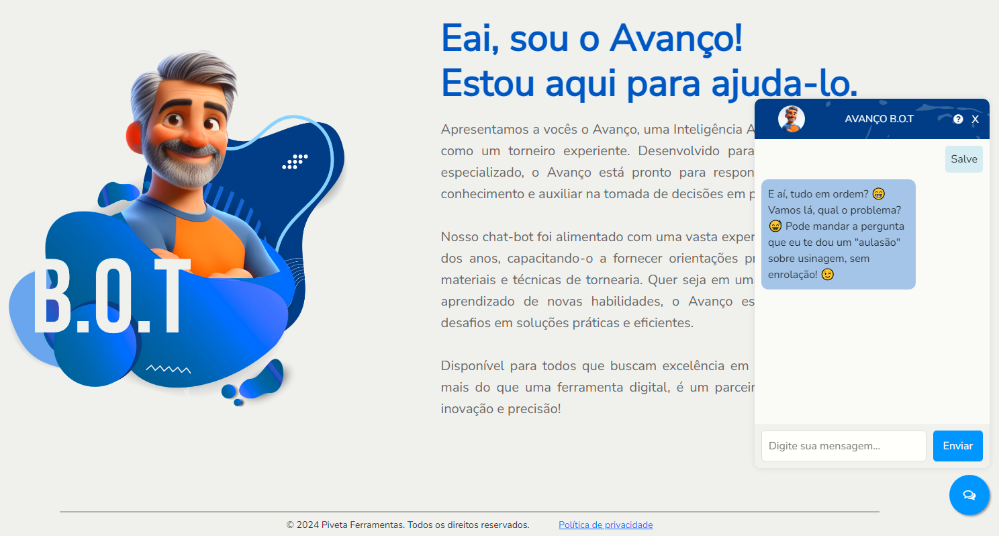

### Piveta System - Chat-BOT 🤖
  
---
  
O chat-bot "Avanço" é um programa de computador projetado para simular conversas humanas através de mensagens de texto ou voz. 

Ele utiliza inteligência artificial para entender e responder a perguntas, realizar tarefas automatizadas e oferecer suporte em tempo real. 

Chat-bots são amplamente utilizados em atendimento ao cliente, marketing e outras áreas, proporcionando interações rápidas e eficientes com usuários.
  
### Pré-requisitos
  
---
  
Antes de iniciar, certifique-se de que você tem os seguintes itens:
  
- Acesso a um terminal de comando.
- Permissões adequadas para criar diretórios e arquivos no sistema.
- Permissões para a instalação de bibliotecas e programas no sistema.
  
### Arquitetura do Projeto
  
---

Para facilitar a compreensão, utilizei a abordagem de arquitetura C4 para ilustrar de maneira clara e organizada o funcionamento do processo de bipagem, destacando as diferentes camadas e seus componentes essenciais.

##### Contexto de Bipagem

A primeira etapa do desenho é mostrar as interações de forma macro, focando nas comunicações e dependências entre sistemas e usuários no chat-bot "Avanço". Esse diagrama deve ser compreendido por todos os envolvidos no projeto, tanto técnicos quanto de negócios, que interagem direta ou indiretamente com o sistema.


##### Container de Bipagem

O segundo nível detalha o sistema, descrevendo seus containers e como eles se comunicam. Foca na arquitetura e tecnologias usadas, mostrando como o sistema é construído de forma macro. Um container pode ser uma aplicação web, um banco de dados, ou um sistema de arquivos. Este diagrama é direcionado à equipe técnica, como desenvolvedores e profissionais de suporte.


##### Componentes de Bipagem

No terceiro nível, detalhamos as partes que compõem os containers, incluindo interações, responsabilidades e tecnologias de forma mais minuciosa. Um sistema pode ter vários diagramas de componente, focando na equipe técnica de desenvolvimento.


  
### Estrutura do Projeto
  
---
  
##### Diretórios e Arquivos
  
  
```RP/
├── app/
│   ├── static/
│   |    ├── css/
│   |    │   └── chat-bot.css
│   |    │   └── blueprint.css
│   |    └── js/
│   |        └── chat-bot.js
│   |        └── blueprint.js
│   ├── templates/
│   │    └── chat-bot.html
│   │    └── blueprint.html
│   ├── __init__.py
│   ├── .flaskenv
│   └── routes.py
├── venv/
└── requirements.txt
```	
  
### Backend (Flask)
  
---
  
##### Instalação de Dependências
  
Instale as dependências do projeto com o seguinte comando: ```pip install -r requirements.txt```
  
##### Rotas
Definimos uma rota /chat para fazer requisições ao chat-bot:
  
``` Ruby
from flask import Flask, request, jsonify
from datetime import datetime
  
app = Flask(__name__)
  
@app.route('/chat', methods=['POST'])
def chat():
    data = request.get_json()
    text = data.get('text', '')

    prompt = """Você é um torneiro mecânico chamado 'Avanço' que entende tudo sobre usinagem, 
    consegue falar facilmente sobre dúvidas técnicas e explicar de modo que qualquer pessoa entenda de modo claro e assertivo, 
    além de ter uma personalidade alegre mas com seriedade e firmeza na fala. 
    Seja direto e não precisa se apresentar a cada resposta técnica. 
    Sendo assim, a pergunta é: """

    envio = f'{prompt + text}'

    chat_session = model.start_chat(history=[])
    response = chat_session.send_message(envio)

    return jsonify({'response': response.text})
  
if __name__ == '__main__':
    app.run(debug=True)
```

Para visualizar préviamente o funcionamento do chat-bot Avanço, também foi criado uma página de apresentação:

``` Ruby
@app.route("/chat-bot", methods=["GET"])
def chatBot():
    return render_template('chat-bot.html')
```
  
### Frontend
  
---
  
##### HTML
O HTML do chat-bot Avanço foi criado em 'Blueprint.html', justamente para ser um assistente que possa ser utilizado em qualquer ferramenta do sistema:

  
``` Ruby
    <div class="chat-button-container">
        <button class="float-button" onclick="toggleChat()"><i class="fa fa-comments-o" aria-hidden="true"></i>
        </button>
    </div>

    <div id="chat-window" class="chat-window">
        <div class="chat-header">
            
            <h2>AVANÇO B.O.T</h2>
            <a href="/chat-bot"><i class="fa fa-question-circle" aria-hidden="true"></i></a>
            <button class="close-button-chat" onclick="toggleChat()">X</button>
        </div>
        <div id="chat-box" class="chat-box">

        </div>
        <div class="input-area">
            <input class="input-field" type="text" id="user-input" placeholder="Digite sua mensagem...">
            <button class="enviar-chat" onclick="sendMessage()">Enviar</button>
        </div>
    </div>
```

##### CSS
  
O CSS estiliza os componentes da página:
  
1. Atributo ``style`` para Ocultar a caixa de mensagem do chat-bot:
  
O atributo ``style`` é aplicado a classe ``chat-window`` do popup para torná-lo inicialmente oculto. Utilize a propriedade ``display`` com o valor ``none``.
  
ex: ``<div class="chat-window" style="display: none;"></div>``
  
2. ``transition`` para animação:
  
As ``transition`` podem ser utizadas para criar animações no CSS fluidas.
  
Ex: 
``` Ruby
.chat-message {
    transition: opacity 0.3s ease, transform 0.3s ease;
}
```
  
3. ``Media Queries`` para redimensionar:
  
As ``Media Queries`` permitem adaptar o layout e o estilo de uma página com base em diferentes características do dispositivo do usuário, como tamanho da tela, orientação, resolução e tipo de dispositivo (desktop, tablet, mobile).
  
Ex:
  
``` Ruby
@media only screen and (max-width: 1200px) {
    .image-container {
        width: 60%;
    }

    .text-container {
        width: 100%;
    }
}
```
##### Javascript
  
O JavaScript dá vida chat-bot Avanço, controlando sua visibilidade e interação com o usuário.
  
1. Requisitar a pergunta:
  
Utilize a função ``sendMessage()`` para capturar a mensagem inserida no ``user-input`` pelo usuário e enviar a requisição para a ``API`` do chat-bot.
  
Ex:
  
``` Ruby
async function sendMessage() {
    const userInput = document.getElementById('user-input').value;
    if (!userInput) return;

    const chatBox = document.getElementById('chat-box');
    const userMessage = document.createElement('div');
    userMessage.className = 'chat-message user-message';
    userMessage.textContent = userInput;
    chatBox.appendChild(userMessage);

    setTimeout(function() {
        userMessage.classList.add('show');
    }, 10);

    document.getElementById('user-input').value = '';

    const response = await fetch('/chat', {
        method: 'POST',
        headers: {
            'Content-Type': 'application/json',
        },
        body: JSON.stringify({ text: userInput }),
    });
...
```
  
2. Mostrar a resposta:
  
Para visualizar a mensagem, utilizamos um método de formatação de texto, deixando-o legível ao usuário e intuitivo.
  
Ex:
  
``` Ruby
...
    const data = await response.json();
    let botResponse = data.response;

    botResponse = botResponse
        .replace(/\n/g, '<br>')
        .replace(/(\*\*)(.*?)\1/g, '<strong>$2</strong>')
        .replace(/(\*)(.*?)\1/g, '<em>$2</em>')
        .replace(/`([^`]+)`/g, '<code>$1</code>');

    const botMessage = document.createElement('div');
    botMessage.className = 'chat-message bot-message';
    botMessage.innerHTML = botResponse;
    chatBox.appendChild(botMessage);

    setTimeout(function() {
        botMessage.classList.add('show');
    }, 10);
    
    chatBox.scrollTop = chatBox.scrollHeight;
}
```
  
3. Mostrar caixa de mensagem:
  
Como esse assistente está disponível em todas as ferramentas, de algum modo temos que deixa-lo discreto. E claro, para acessa-lo utilizamos do botão no canto inferior direito.
  
Ex:
  
``` Ruby
function toggleChat() {
    var chatWindow = document.getElementById('chat-window');
    if (chatWindow.style.display === 'none' || chatWindow.style.display === '') {
        chatWindow.style.display = 'flex';
        setTimeout(function() {
            chatWindow.classList.add('open');
        }, 10);
    } else {
        chatWindow.classList.remove('open');
        setTimeout(function() {
            chatWindow.style.display = 'none';
        }, 300);
    }
}
```
  
### Conclusão
  
---


  
Este sistema permite a interação para dúvidas e curiosidade sobre usinagem. O Avanço foi pensado para todos os colaboradores como forma de suporte e fácil acesso a informações cruciais para alavancar produtividade, com uma interface amigável e responsiva, garante uma boa experiência do usuário em diferentes dispositivos e cenários.