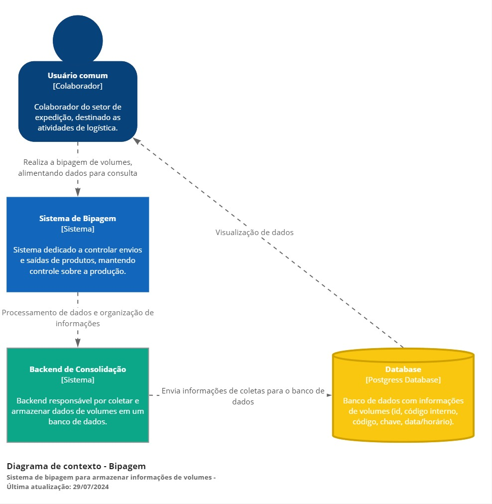

### Piveta System - Dashboard 📊
  
---
  
Os dashboards do [Looker Studio](https://lookerstudio.google.com/) integrados por iframe à página permitem acompanhar as estatísticas da empresa em tempo real de maneira eficaz. 

Utilizando Flask e HTML/CSS/JavaScript, esses componentes oferecem uma interface amigável e desempenho robusto. Os dados, armazenados em um banco de dados de planilhas, são apresentados de forma dinâmica, possibilitando:

#### Marketing:

* Meta de leads;
* Comparativo mensal de leads;
* Objetivos e resultados - Vendas e engajamento;
* Gastos de investimento.

#### Google Analytics:

* Usuários ativos - Canal:
* Novos usuários;
* Visualização.

#### E-commerce

* Metas;
* Progresso;
* Canais de vendas;
* Gráfico por região;
* Quantidade de pedidos.

#### Comercial

* Metas;
* Vendas realizadas;
* Contador de orçamentos;
* Progresso;
* Ranking.

Essa integração garante que as informações estejam sempre atualizadas, facilitando a tomada de decisões informadas e a otimização das operações empresariais.
  
### Arquitetura do Projeto
  
---

Para facilitar a compreensão, utilizei a abordagem de arquitetura C4 para ilustrar de maneira clara e organizada o funcionamento do processo de dashboard, destacando as diferentes camadas e seus componentes essenciais.

# REALIZAR ARQUITETURA C4 AQUI !!!

##### Contexto Dashboard

A primeira etapa do desenho é mostrar as interações de forma macro, focando nas comunicações e dependências entre sistemas e usuários no processo de bipagem. Esse diagrama deve ser compreendido por todos os envolvidos no projeto, tanto técnicos quanto de negócios, que interagem direta ou indiretamente com o sistema.



##### Container Dashboard

O segundo nível detalha o sistema, descrevendo seus containers e como eles se comunicam. Foca na arquitetura e tecnologias usadas, mostrando como o sistema é construído de forma macro. Um container pode ser uma aplicação web, um banco de dados, ou um sistema de arquivos. Este diagrama é direcionado à equipe técnica, como desenvolvedores e profissionais de suporte.


##### Componentes Dashboard

No terceiro nível, detalhamos as partes que compõem os containers, incluindo interações, responsabilidades e tecnologias de forma mais minuciosa. Um sistema pode ter vários diagramas de componente, focando na equipe técnica de desenvolvimento.


  
### Estrutura do Projeto
  
---
  
##### Diretórios e Arquivos
  
  
```RP/
├── app/
│   ├── static/
│   |    ├── css/
│   |    │   └── dashboard.css
│   |    └── js/
│   |        └── dashboard.js
│   ├── templates/
│   │    └── dashboard.html
│   ├── __init__.py
│   ├── .flaskenv
│   └── routes.py
└── venv/
```	
  
### Backend (Flask)
  
---
  
##### Rotas
Definimos uma rota /dashboard para acessar e visualizar a página:
  
``` Ruby
@app.route("/dashboard", methods=["GET"])
@login_required
def dashboard():
    return render_template('dashboard.html')
```
  
### Frontend
  
---
  
##### HTML
O HTML contém um iframe gerado pelo Looker Studio, trazendo todas as informações e gráficos para visualização:
  
Ex:
  
``` Ruby
<iframe>
    src="https://lookerstudio.google.com/embed/reporting/bdebbb1d-0c48-45a0-8113-a82b1de8d6a9/page/p_o0jl1ltajd"
    frameborder="0" style="border:0" allowfullscreen
    sandbox="allow-storage-access-by-user-activation allow-scripts allow-same-origin allow-popups allow-popups-to-escape-sandbox">
</iframe>
```

##### CSS
  
O CSS estiliza os componentes da página:
  
1. Atributo ``style`` para:
  
O atributo ``style`` é aplicado aos elementos para estilizar a página e tornar visualmente agradável e simples para uso.
    
2. ``Media Queries`` para redimensionar:
  
As ``Media Queries`` permitem adaptar o layout e o estilo de uma página com base em diferentes características do dispositivo do usuário, como tamanho da tela, orientação, resolução e tipo de dispositivo (desktop, tablet, mobile).
  
Ex:
  
``` Ruby
@media (max-width: 767px) {
    .frase-dashboard {
        padding-inline: 5%;
    }
}
```

##### Javascript
  
O JavaScript dá vida a visibilidade e interação com o usuário, trazendo elementos dinâmicos como data atual e dias úteis restantes.
  
1. Data atual:
  
A função data atual é autoexplicativa, trazendo o dia de hoje para informar ao usuarios o dia que estamos.
  
Ex:
  
``` Ruby
  function formatDate(date) {
    const day = String(date.getDate()).padStart(2, '0');
    const month = String(date.getMonth() + 1).padStart(2, '0');
    const year = date.getFullYear();
    return `${day}/${month}/${year}`;
  }
```
  
2. Dias úteis:
  
Para contar os dias úteis, o JS traz como função uma feramenta essencial para visualizarmos o tempo restante para finalizar o mês.
  
Ex:
  
``` Ruby
  function getBusinessDaysRemaining() {
    const today = new Date();
    const currentMonth = today.getMonth();
    const currentYear = today.getFullYear();

    let businessDaysRemaining = 0;
    let date = new Date(today);

    while (date.getMonth() === currentMonth) {
      if (!isWeekend(date)) {
        businessDaysRemaining++;
      }
      date.setDate(date.getDate() + 1);
    }

    return businessDaysRemaining;
  }
```
  
### Conclusão
  
---

Os dashboards integrados ao Piveta System, utilizando Looker Studio via iframes, permitem monitorar estatísticas empresariais em tempo real de forma eficaz. Desenvolvidos com Flask e HTML/CSS/JavaScript, apresentam dados dinâmicos sobre marketing, Google Analytics, e-commerce e comercial, auxiliando na tomada de decisões estratégicas.