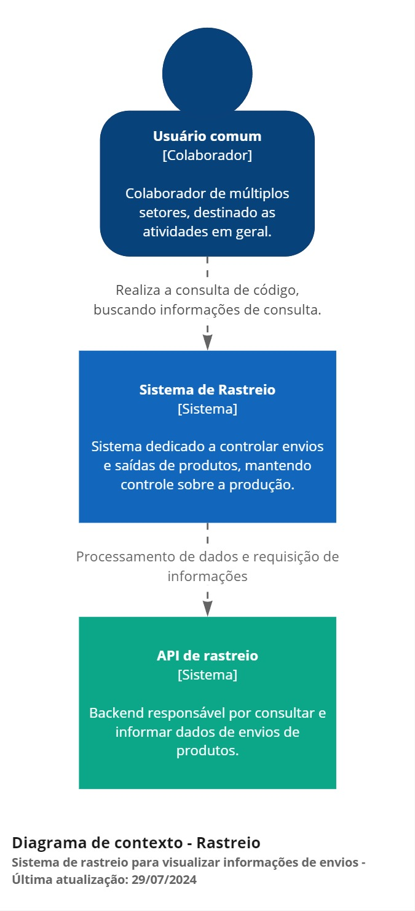
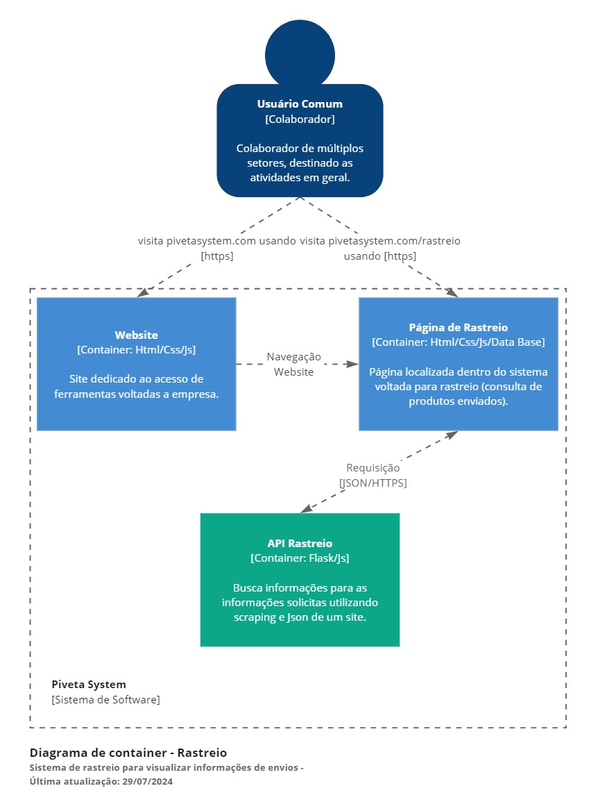
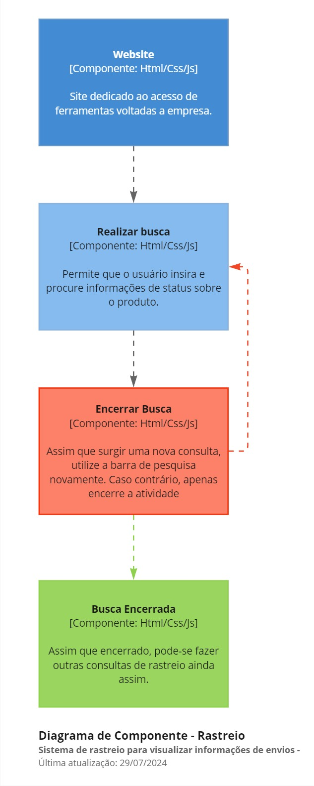

### Piveta System - Rastreio 📦
  
---
  
O sistema de rastreio é um aplicativo web desenvolvido usando Flask para o backend e HTML/CSS para o frontend.
  
Ele permite a pesquisa e acompanhamento do envio de produtos, trazendo em tempo real o status do produto enviado. Os dados são buscados diretamente na base de informações dos correios.

### Pré-requisitos
  
---
  
Antes de iniciar, certifique-se de que você tem os seguintes itens:
  
- Acesso a um terminal de comando.
- Permissões adequadas para criar diretórios e arquivos no sistema.

### Arquitetura do Projeto
  
---

Para facilitar a compreensão, utilizei a abordagem de arquitetura C4 para ilustrar de maneira clara e organizada o funcionamento do processo de rastreio, destacando as diferentes camadas e seus componentes essenciais.

##### Contexto de Bipagem

A primeira etapa do desenho é mostrar as interações de forma macro, focando nas comunicações e dependências entre sistemas e usuários no processo de bipagem. Esse diagrama deve ser compreendido por todos os envolvidos no projeto, tanto técnicos quanto de negócios, que interagem direta ou indiretamente com o sistema.



##### Container de Bipagem

O segundo nível detalha o sistema, descrevendo seus containers e como eles se comunicam. Foca na arquitetura e tecnologias usadas, mostrando como o sistema é construído de forma macro. Um container pode ser uma aplicação web, um banco de dados, ou um sistema de arquivos. Este diagrama é direcionado à equipe técnica, como desenvolvedores e profissionais de suporte.



##### Componentes de Bipagem

No terceiro nível, detalhamos as partes que compõem os containers, incluindo interações, responsabilidades e tecnologias de forma mais minuciosa. Um sistema pode ter vários diagramas de componente, focando na equipe técnica de desenvolvimento.



### Estrutura do Projeto
  
---
  
##### Diretórios e Arquivos

```RP/
├── app/
│   ├── static/
│   |     └── css/
│   |         └── rastreio.css
│   ├── templates/
│   │    └── rastreio.html
│   ├── utils/
│   │    └── tracking.py
│   ├── __init__.py
│   ├── .flaskenv
│   └── routes.py
├── venv/
└── requirements.txt
```	

### Backend (Flask)
  
---
  
##### Instalação de Dependências
  
Instale as dependências do projeto com o seguinte comando: ```pip install -r requirements.txt```

##### Rotas
Definimos uma rota /status para buscar informações do envio do produto utilizando a API criada (``api_rastreio()``). Assim que solicitado, somos direcionados para a página com todas as informações do produto procurado, e para as informações corretas serem mostradas na página, imagens são carregadas de acordo com o status do produto.
  
``` Ruby
@app.route("/status", methods=['GET','POST'])
def status():
    registros = None
    error = None
    imagem_status = 'error.png'

    if request.method == 'POST':
        codigo_rastreio = request.form.get('codigo_rastreio')
        registros, error = fetch_tracking_info(codigo_rastreio)

        if error:
            return render_template('status.html', error=error)
        if registros:
            ultimo_registro = registros[0]
            imagem_status = selecionar_imagem(ultimo_registro['status'])

    return render_template('status.html', registros=registros, imagem_status=imagem_status, error=error)

def selecionar_imagem(status):
    if status == "Objeto postado após o horário limite da unidade":
        return "postado.png"
    elif status == "Objeto em transferência - por favor aguarde":
        return "transito.png"
    elif status == "Objeto saiu para entrega ao destinatário":
        return "transito.png"
    elif status == "Objeto recusado pelo destinatário":
        return "nao-recebido.png"
    else:
        return "entregue.png"
    

@app.route("/api/rastreio/<codigo_rastreio>")
def api_rastreio(codigo_rastreio):
    registros, error = fetch_tracking_info(codigo_rastreio)
    if error:
        return {"error": error}, 400
    return {"registros": registros}, 200
```

---

##### HTML
O HTML contém a estrutura para a busca de status de produtos, botões e espaços para inserir informações:
  
1. Elemento ``div``:
  
O elemento ``div`` serve como container principal para separação de informações da página de rastreio, encapsulando conteúdos deixando de modo organizado.
  
Ex:
  
``` Ruby
    <div class="container-full-width">
        <div class="container1">
            <div class="text-section">
                <h1 class="titulo-controle">Não perca o controle de envios!</h1>
                <p class="texto-controle">É essencial manter-se organizado e eficiente na gestão de envios para garantir que todas as entregas sejam feitas no prazo. Mantenha registros precisos, monitore cada etapa do processo e esteja sempre pronto para ajustar conforme necessário. O controle rigoroso não apenas melhora a eficiência, mas também fortalece a confiança dos clientes e parceiros na sua capacidade de entrega.</p>
            </div>
            <div class="image-section">
                
            </div>
        </div>
    </div>
```

##### CSS
  
O CSS estiliza os componentes da página:
  
1. Atributo ``style`` para Tornar o Sistema Intuitivo

Para garantir que os elementos pop-up no sistema de rastreamento sejam intuitivos e fáceis de usar, o atributo ``style`` é aplicado aos elementos HTML relevantes.

  
2. ``Media Queries`` para redimensionar:
  
As ``Media Queries`` permitem adaptar o layout e o estilo de uma página com base em diferentes características do dispositivo do usuário, como tamanho da tela, orientação, resolução e tipo de dispositivo (desktop, tablet, mobile).
  
Ex:
  
``` Ruby
@media only screen and (max-width: 770px) {
    .card {
        width: 85% !important;
        min-height: 325px;
    }
}
```

### Conclusão
  
---
  
Este sistema permite a busca de status de produtos enviados, tudo isso com informações em tempo real da base de dados dos correios. O frontend responsivo garante uma boa experiência do usuário em diferentes dispositivos.